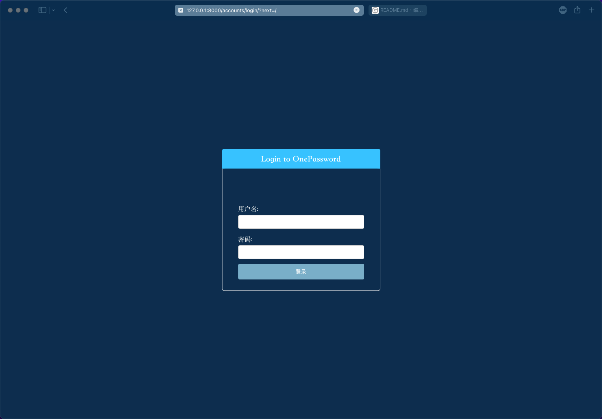
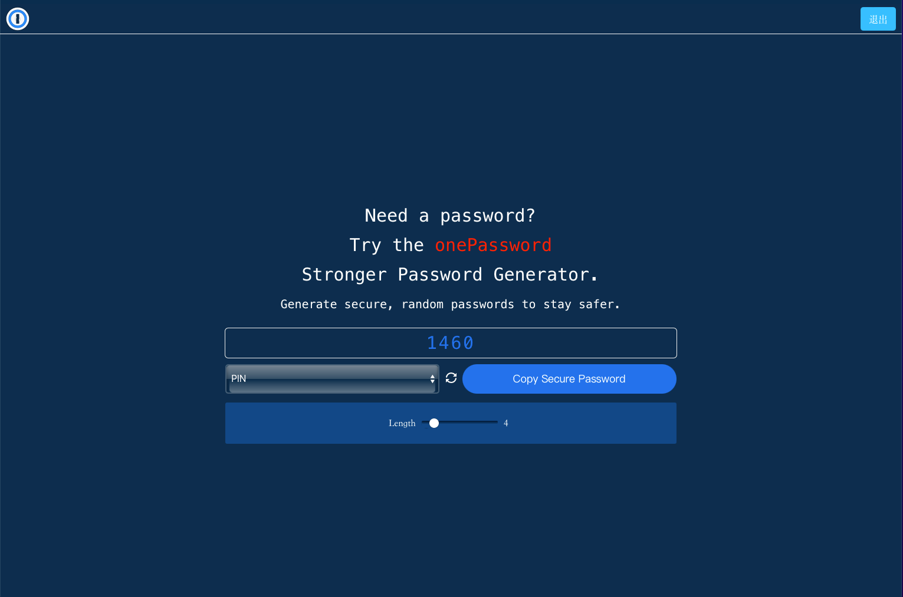
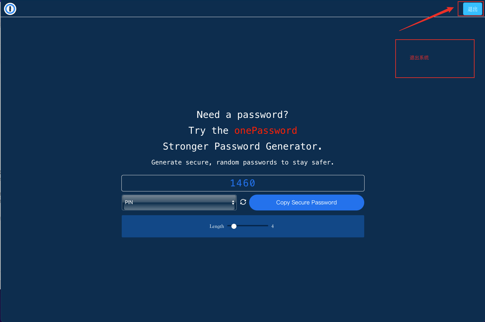

# one password

#### 介绍
本项目是使用Python Django开发的一个强密码随机生成器，你可以使用它来生成随机密码，随机可记忆密码，随机PIN码。项目参考1Password项目，基本大部分功能都已实现。

#### 软件架构
软件架构说明
本项目使用Python Django开发，Python版本为3.8+，Django版本为3.2，为了更好得使用

#### 安装教程

1.  按照软件架构说明和requirements.txt文件安装环境
2.  使用`python manage.py createsuperuser`创建超级管理员用户，为了使你产生的密码更加安全，需要登录才能使用
3.  使用用户登录后，运行`python manage.py runserver`可以正常使用

#### 使用说明截图

1.  登录界面

2.  随机密码

3.  随机可记忆密码

4.  随机PIN码

5.  退出系统，返回登录界面
